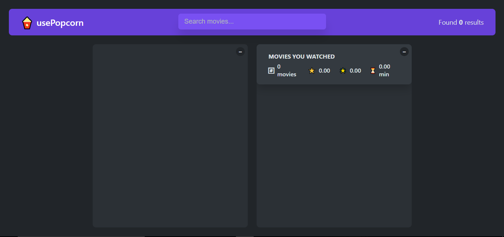
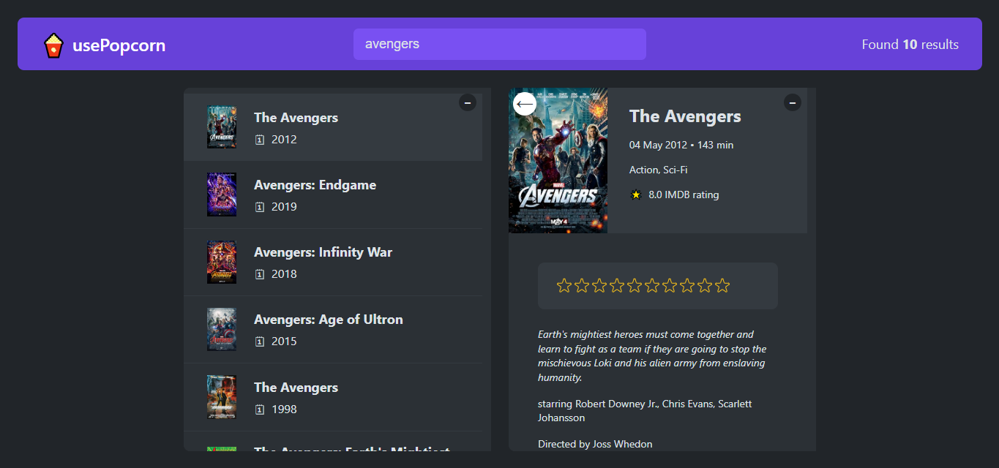

# usePopcorn

usePopcorn is a user-friendly React-based application designed for movie and show enthusiasts. It allows users to effortlessly search for their favorite films and television series, providing detailed information such as ratings, descriptions, and genres. With a sleek interface and intuitive navigation, users can easily save their favorite titles to a personal list, making it simple to keep track of what to watch next. The application leverages various APIs to fetch real-time data, ensuring that users have access to the latest information about their favorite entertainment options.

## How to Use

After installation, run `npm start` to launch the application in your browser.

## Functionality

- Users can search for movies and shows.
- Users can save their favorite movies and shows to a personal list.
- The application provides detailed information about each movie/show, including ratings and descriptions.

## Tech Stack

This project is built using:

- React
- HOOKS
- HTML
- CSS

## Cloning and Installation

To clone and install the repository, run the following commands:

```
git clone https://github.com/Jatinsharma43/usePopcorn.git
cd 07
npm run
```

## Screenshots




## Learnings

Through this project, I learned about state management in React, how to work with APIs, and the importance of user experience in application design.
